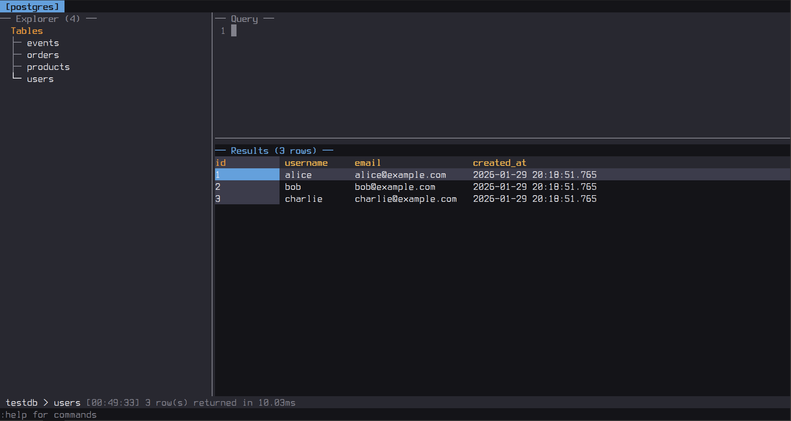

# sqli

A terminal-based SQL client. Supports multiple database backends.

**NOTE: the project is fully vibe-coded.**

## Supported Databases

- **PostgreSQL** - native protocol.
- **MySQL/MariaDB** - native protocol.
- **Cassandra/ScyllaDB** - CQL protocol.
- **ClickHouse** - HTTP API.
- **SQLite** - file-based (bundled).

## Features

- Multi-tab interface.
- Tables explorer.
- Query editor with external editor support.
- SQL autocompletion (keywords, tables, columns).
- Record detail popup for viewing full row data.
- Mouse support for navigation.
- Quick connect via URL (`--connect pg://user@host/db`).
- TOML configuration file with password command support.
- Connection grouping for organizing databases.
- Query templates with placeholders.
- External editor integration (`$EDITOR` or vim).

## Screenshots



## Keybindings

**Connection List**
- `j/k` - navigate connections
- `h/l` - switch groups
- `Enter` - connect

**Navigation**
- `Tab` / `Shift+Tab` - cycle focus
- `Ctrl+w h/j/k/l` - directional focus

**Query Editor**
- `F5` / `Ctrl+E` - execute query
- `Ctrl+Z` - undo
- `Ctrl+R` - redo
- `Ctrl+Space` - autocompletion (keywords, tables, columns)
- `Ctrl+O` - open templates
- `Ctrl+S` - save template
- `Ctrl+G` - external editor
- `Esc :` - command mode

**Sidebar**
- `j/k` - navigate
- `Enter` - expand/preview
- `d` - describe a table
- `r` - refresh the Sidebar

**Output**
- `j/k` - scroll rows
- `h/l` - scroll columns
- `^/$` - first/last column
- `gg/G` - go top/bottom
- `PageUp/Down` - page scroll
- `Enter` - open record detail popup
- `v` - cell visual select (current column)
- `V` - line visual select (entire rows)
- `y` - copy selection to clipboard (or single cell without visual mode)
- `Esc` - cancel visual selection

**Record Detail Popup**
- `j/k` - navigate fields
- `Esc` - close popup

**Mouse**
- Click on pane to focus.
- Click on table in sidebar to select.
- Click on row in output to open record detail.
- Click on connection/database to connect.

**Commands**
- `:q` - quit a tab
- `:qa` or `q!` - quit all tabs
- `:new` - new tab
- `:next/:prev` - switch tabs
- `:db` - switch database (within current connection)
- `:system` - toggle system DBs

## Quick Connect

Connect directly using a connection string URL:

```bash
sqli --connect "pg://user:pass@localhost:5432/mydb"
```

**Supported formats:**
| Type | URL Format |
|------|------------|
| PostgreSQL | `pg://user:pass@host:port/database` |
| MySQL | `my://user:pass@host:port/database` |
| Cassandra | `cs://user:pass@host:port/keyspace` |
| ClickHouse | `ch://user:pass@host:port/database` |
| SQLite | `sq:///path/to/database.db` |

- If database is specified → connects directly
- If database is omitted → shows database list for selection
- Default ports are used if not specified (5432, 3306, 9042, 8123)
- Default users: `postgres` (pg), `root` (my), `default` (ch)

**Examples:**
```bash
sqli --connect "pg://postgres@localhost/mydb"      # Direct connect to mydb
sqli --connect "pg://postgres:secret@localhost"    # Shows database list
sqli --connect "my://root@127.0.0.1:3306"          # MySQL, shows DB list
sqli --connect "sq:///home/user/data.db"           # SQLite file
sqli --connect "sq://./local.db"                   # SQLite relative path
```

## Configuration

Configuration is loaded from (in order of priority):
1. `--config` flag (e.g., `sqli --config /path/to/config.toml`)
2. `./sqli.toml` (current directory)
3. `~/.config/sqli/config.toml`

### Example config.toml

```toml
[local-postgres]
type = "postgres"
host = "localhost"
port = 5432
user = "postgres"
password = "secret"
group = "Local"

[production]
type = "postgres"
host = "db.example.com"
user = "admin"
password_cmd = "pass show db/production"
group = "Production"

[local-mysql]
type = "mysql"
host = "localhost"
port = 3306
user = "root"
password = "secret"
group = "Local"

[analytics]
type = "clickhouse"
host = "clickhouse.local"
port = 8123
user = "default"
group = "Analytics"

[analytics-secure]
type = "clickhouse"
host = "clickhouse.example.com"
port = 8443
user = "default"
tls = true
group = "Analytics"

[scylla-cluster]
type = "cassandra"
host = "scylla1.local"
port = 9042
user = "cassandra"
password = "cassandra"
group = "NoSQL"

[my-sqlite]
type = "sqlite"
path = "/path/to/database.db"
group = "Local"
```

### Connection Options

| Option | Description |
|--------|-------------|
| `type` | Database type: `postgres`, `mysql`, `cassandra`, `clickhouse`, `sqlite` |
| `host` | Server hostname |
| `path` | File path (SQLite only) |
| `port` | Server port (optional, uses default for type) |
| `user` | Username |
| `password` | Password (plaintext) |
| `password_cmd` | Command to retrieve password (e.g., `pass show db/prod`) |
| `database` | Default database (skips database selection) |
| `tls` | Enable TLS (default: false) |
| `readonly` | Read-only mode, blocks non-SELECT queries (default: false) |
| `group` | Group name for organizing connections (optional) |

Groups are displayed as tabs in the connection list. Use `h/l` to switch between groups. Connections without a group only appear under "All".

## Query Templates

Templates are saved to `~/.config/sqli/templates.sql` in a simple format:

```sql
--- Count Rows [global]
SELECT COUNT(*) FROM <table>;

--- Active Users [my-connection]
SELECT * FROM users
WHERE active = true
LIMIT <limit>;

--- Find by ID [global]
SELECT * FROM <table> WHERE id = <id>;
```

- Each template starts with `--- Name [scope]`.
- Scope is either `global` (all connections) or a connection name.
- Templates can contain `<placeholder>` markers - cursor will be positioned there on insert.
- Use `Ctrl+S` to save the current query as a template.
- Use `Ctrl+O` to open the templates list.
- Use `/` to search templates by name (vim-style).
- Use `Ctrl+G` to edit a template in your `$EDITOR` (edits name, scope, and query).

## Autocompletion

Press `Ctrl+Space` in the query editor to trigger autocompletion:

- **Keywords** - SQL keywords (SELECT, FROM, WHERE, etc.)
- **Tables** - tables from current database (context-aware after FROM/JOIN)
- **Columns** - columns after typing `table.` or `alias.`

The completion popup shows:
- `k` - keyword
- `t` - table
- `c` - column

Navigate with `j/k` or arrows, apply with `Enter` or `Tab`, cancel with `Esc`.

## Building

Requires Rust 1.85+ (edition 2024).

```bash
# Debug build
cargo build

# Release build
cargo build --release

# Run directly
cargo run
```

Binary will be at `target/release/sqli`.

## License

MIT
